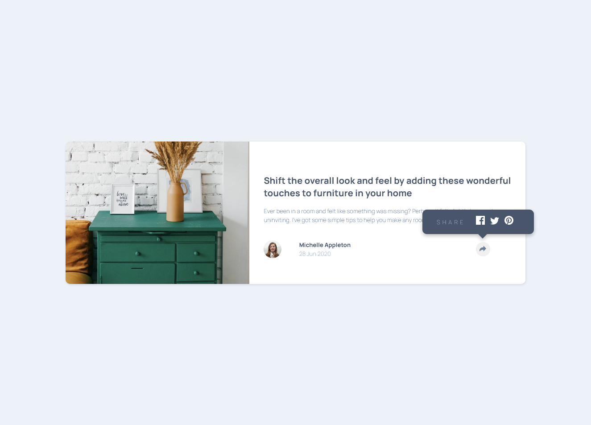

# Frontend Mentor - Article preview component solution

## 👋 Introduction

Hello, welcome and thank you for checking out this ReadMe.

This is a solution to the [Article preview component challenge on Frontend Mentor](https://www.frontendmentor.io/challenges/article-preview-component-dYBN_pYFT).
Frontend Mentor challenges help me improve my coding skills by building realistic projects.

If you have any questions or if you can give me some advice to help me become a better developer, please feel free to send me a message. [My contact information is down below.](#-author)

## 📑 Table of contents

- [Overview](#-overview)
- [The challenge](#the-challenge)
- [Screenshot](#screenshot)
- [Links](#links)
- [My process](#-my-process)
- [Built with](#built-with)
- [Reflection on Learning Goals](#reflection-on-learning-goals)
- [Author](#-author)
- [Acknowledgments](#-acknowledgments)

**Note: Delete this note and update the table of contents based on what sections you keep.**

## 📋 Overview

### The challenge

Users should be able to:

- View the optimal layout for the component depending on their device's screen size
- See the social media share links when they click the share icon

### Screenshot

### Links

- Solution URL: [https://www.frontendmentor.io/challenges/article-preview-component-dYBN_pYFT/hub/article-preview-component-Piyx1l_eG](https://www.frontendmentor.io/challenges/article-preview-component-dYBN_pYFT/hub/article-preview-component-Piyx1l_eG)
- Live Site URL: [https://lumensum.github.io/FEM-article-preview-component/](https://lumensum.github.io/FEM-article-preview-component/)

## 🎓 My process

### Personal Learning Goals

When making this page, I will make sure I keep responsiveness in mind. It is also important to keep accessibility into account.

### Built with

- Semantic HTML5 markup
- BEM Naming Convention
- Flexbox
- CSS Grid
- Mobile-first workflow

### Reflection on Learning Goals

I changed the colours of the design a little bit. I ran the page through an Color Contrast Accessibility Validator and the colours in the design did not have a high enough contrast, so I converted the colours to HSL and lowered the lightness untill they passed. Then I made the header even slightly more dark so it stands out from the paragraph text.

I made the outline red and dashed to make it stand out from the rest of the page. I need to find more information about this. The default thin blue line did not stand out for me enough, but perhaps people who need to use the outline have tools to see it better. I have to research this more in the future.

I tried to make sure all buttons and anchors have some sort or aria-label or hidden text.

The final solution is very responsive and accessable in my opinion. I zoomed en dragged my browser windows around and the page kept looking fine.

## 📧 Author

- 💻️ Frontend Mentor - [@royschrauwen](https://www.frontendmentor.io/profile/royschrauwen)
- 🍗 Twitter - [@royschrauwen](https://www.twitter.com/royschrauwen)

## 🙏 Acknowledgments

I got a lot of tips, tricks, advice and help from the Frontend Mentor Community on Slack. I am really greatful for the awesome support.
